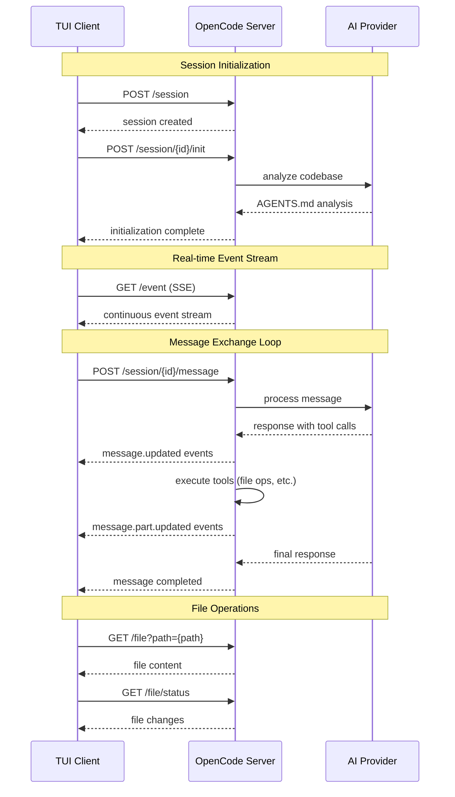

# opencoders

**A terminal-native, high-performance, model-agnostic client for coding tools.**

This TUI provides a responsive and lighning fast interface for interacting with the [`sst/opencode`](https://github.com/sst/opencode) headless server.
The primary goal is to build a seamless experience that integrates identical functionality between inline, fullscreen, and in-editor modes.

The project leverages Rust's characteristics for an ideal TUI experience:
strict compile-time type checking enforces allowable program states,
and performant execution gives a responsiveness you can feel.

And in the future:
no multiple ownership provides for a concurrent and safe implementation of multi-session coding,
and Rust wasm build targets can hook in `crossterm` against `xterm.js` for browser deployments.

> [!NOTE]
>
> **Required:**
> - REPL loop
> - pretty printing
>     1. diffs
>     1. markdown
>     1. checklist
>     1. file tree
>     1. thinking tokens
>     1. tool calls
> - config handling (flags and rc)
>     1. inline vs alt screen
>     1. model selection
> - CI/CD
>     1. full unit test suite
>     1. e2e test with local model
>     1. error handling and recovery
>     1. cargo deployment via git repo
> 
> **Nice-to-have:**
> - multi-session
> - cmd permissions
> - theming
> - UI token usage
> - UI @ file finder
> - UI model select
> - UI slash commands
> - UI modal toggle (PLAN vs. BUILD vs. DEBUG)
> - nvim hook-in

## Quick Start

> [!WARNING]
> **Currently this tool is WIP.**
>
> The below steps are for a development setup, and are not yet friendly for a
> convenient end-user installation.

### Prerequisites
- Rust toolchain (1.70+)
- Git
- GitHub CLI (optional, for cloning)
- Bun toolchain (1.2+)

### Installation

```bash
# Clone and setup the main opencode monorepo
gh repo clone sst/opencode
cd opencode/packages/opencode/
bun install

# Navigate back and setup the Rust TUI client
cd ../../
gh repo clone CSRessel/opencoders
cd opencoders
cargo build --release

# Launch the TUI
cargo run
```

<!--
TODO once packaged correctly
(deps on opencode executable on system)

### Alternative Installation
```bash
# Install directly from source
cargo install --git https://github.com/CSRessel/opencoders
opencoders
```
-->

## Features

- **Native Performance**: Built with Rust for minimal resource usage and maximum responsiveness
- **Terminal Integration**: Supports both alternate screen and inline modes for flexible usage
- **Type-Safe API**: Auto-generated client bindings ensure compile-time API compatibility
- **Async Architecture**: Non-blocking I/O keeps the interface responsive during server communication

## API Integration

The client maintains type-safe communication with the opencode server through automatically generated bindings.
The OpenAPI specification is dynamically generated from the server to ensure perfect API compatibility.

### OpenAPI Generation

#### Using the Makefile (Recommended)

```bash
# Generate OpenAPI specification
make generate-openapi

# Build the project (includes OpenAPI generation)
make build

# Build release version
make build-release

# Run tests
make test

# Clean build artifacts and generated files
make clean

# Show available commands
make help
```

#### Manual Generation

```bash
# Generate OpenAPI specification directly
./scripts/generate-openapi.sh
```

#### Continuous Integration

Integrate OpenAPI generation into your CI pipeline:

```yaml
# GitHub Actions workflow
name: Build opencoders
on: [push, pull_request]

jobs:
  build:
    runs-on: ubuntu-latest
    steps:
      - uses: actions/checkout@v4
      - name: Setup Rust
        uses: actions-rs/toolchain@v1
        with:
          toolchain: stable
      - name: Generate API bindings
        run: |
          cd packages/opencoders
          make generate-openapi
```

## Development

### Architecture

The application follows **The Elm Architecture** pattern for predictable state management:
- **Model**: Single source of truth for application state
- **Update**: Pure functions handling state transitions
- **View**: Declarative UI rendering with `ratatui`

### Key Dependencies
- `ratatui` - Terminal UI framework
- `tokio` - Async runtime
- `reqwest` - HTTP client for server communication

### OpenCode Server

The application is built against the server implemented at [`sst/opencode`]()

At the time of writing, the general flow with this server implementation is as follows:

**Session Management:**
- `GET /session` - List all sessions
- `POST /session` - Create new session
- `DELETE /session/{id}` - Delete session
- `POST /session/{id}/message` - Send user message
- `GET /session/{id}/message` - Get message history
- `POST /session/{id}/abort` - Abort session
- `POST /session/{id}/init` - Initialize session with AGENTS.md analysis

**Real-time Communication:**
- `GET /event` - Server-Sent Events stream for live updates (continuous)

**File Operations:**
- `GET /file?path={path}` - Read file content
- `GET /file/status` - Get file change status

**Configuration:**
- `GET /config` - Get app configuration
- `GET /config/providers` - Get available AI providers



### Example HTTP Traffic

Capture example HTTP traffic like:

```
# Capture port 8080 traffic in the background
sudo tcpdump -i lo -s 0 -A -U -# -w capture-edits.pcap 'port 8080' &

# Then make some edits
opencode --port 8080

# Then view the traffic in various ways
sudo pkill tcpdump
tcpdump -i lo -s 0 -A -U -# -r capture-edits.pcap
tcpdump -r ../../capture-edits.pcap -A | grep -o -e '(POST|GET) /[^ ]*' | sort | uniq -c | sort -nr
```

With output like:

```
reading from file capture-edits.pcap, link-type EN10MB (Ethernet), snapshot length 262144
   2818 POST /log
     63 GET /event`)\n
     15 POST /session`
     15 POST /session/{id}/message`
     15 POST /session/{id}/init`
     15 POST /session/{id}/abort`
     15 GET /session`
     15 GET /session/{id}/message`
     15 GET /file?path={path}`
     15 GET /file/status`
     15 GET /event`
     15 GET /event
     15 GET /config`
     15 GET /config/providers`
     13 POST /session\n
     13 POST /session/{id}/message\n
     13 POST /session/{id}/init\n
     13 GET /file?path={path}\n
     13 GET /file/status\n
      2 POST /session\n00055|
      2 POST /session/{id}/message\n00067|
      2 POST /session/{id}/init\n00057|
      2 POST /session/ses_7cb083d9affexkZALb1l7Cn6JC/message
      2 GET /file?path={path}\n00077|
      2 GET /file/status\n00079|
      2 GET /event`)","time":{"start":1753235334533}}}}
```

### Building from Source

```bash
# Development build
cargo build

# Optimized release build
cargo build --release

# Run tests
cargo test

# Generate fresh API bindings
make generate-openapi
```
