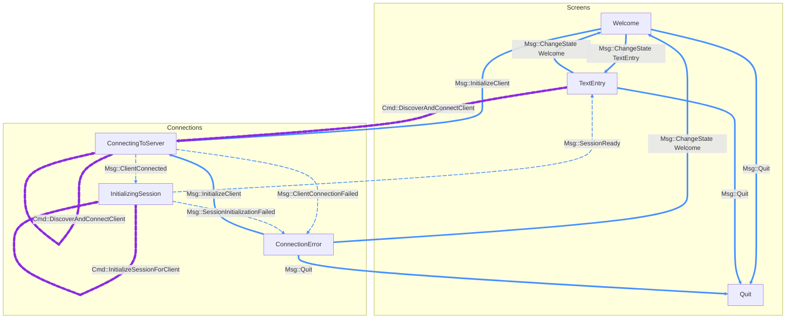

# opencoders

**A terminal-native, high-performance, model-agnostic client for coding tools.**

This TUI provides a responsive and lighning fast interface for interacting with the [`sst/opencode`](https://github.com/sst/opencode) headless server.
The primary goal is to build a seamless experience that integrates identical functionality between inline, fullscreen, and in-editor modes.

The project leverages Rust's characteristics for an ideal TUI experience:
strict compile-time type checking enforces allowable program states,
and performant execution gives a responsiveness you can feel.

And in the future:
no multiple ownership provides for a concurrent and safe implementation of multi-session coding,
and Rust wasm build targets can hook in `crossterm` against `xterm.js` for browser deployments.

> [!NOTE]
>
> **Minimum Usable**:
> - REPL loop
> - basic printing
>     1. ~~files~~
>     1. ~~checklist~~
>     1. ~~shell commands~~
>     1. ~~other tools?~~
> - [x] ~~fix the scroll flickering~~
> - [x] ~~fix how the session list opens in text entry mode~~
> - [x] `54e4ea6` ~~get one single patch (like `2545ad267044`) that fixes tagging~~
> - [x] ~~fix error handling and recovery, tracing, logging, and add color eyre
>   and remove anyhow/thiserror~~
> - [x] ~~add owo colors for stdout messages~~
> - [ ] better status bar styling (working only when busy, row items overflow to be stacked)
> - [ ] dynamic text input box (text wrapping, vertical resizing, scrolling
>   overflow, etc)
> - [ ] unify "new session" and "welcome" pages to one state
> - [ ] fix live message loading
>
> **Minimum Releasable**
> - [ ] basic env for non-interactive TTY execution with synthetic input for
>   "golden tests" and for perf testing
> - [ ] setup some basic perf tests with either divan or criterion
> - [ ] prettify README, cleanup distribution steps, improve opencode dependency
> - [ ] cleanup CI, add precommit, and use Actions for build/release/etc
>
> **First Release:**
> - prettier printing
>     1. diff pager
>     1. markdown highlighting
>     1. checklist shape
>     1. shell highlighting
>     1. prettier tool call boxes
>     1. thinking tokens
>     1. file tree
> - config handling (flags and rc)
>     1. inline vs alt screen
>     1. model selection
> - CI/CD
>     1. full unit test suite
>     1. e2e test with local model
>     1. error handling and recovery
>     1. cargo deployment via git repo
> 
> **Nice-to-have:**
> - ~~multi-session~~
> - cmd permissions
> - theming
> - UI token usage
> - UI @ file finder
> - UI model select
> - UI slash commands
> - UI modal toggle (PLAN vs. BUILD vs. DEBUG)
> - nvim hook-in

## Quick Start

> [!WARNING]
> **Currently this tool is WIP.**
>
> The below steps are for a development setup, and are not yet friendly for a
> convenient end-user installation.

### Prerequisites
- Rust toolchain (1.70+)
- Git
- GitHub CLI (optional, for cloning)
- Bun toolchain (1.2+)

### Installation

```bash
# Clone this repository with the opencode submodule
git clone --recursive https://github.com/CSRessel/opencoders.git
cd opencoders

# Setup the opencode server (submodule)
cd opencode
bun install
cd packages/opencode/
bun install

# Navigate back and build the Rust TUI client
cd ../../
cargo build --release

# Launch the TUI
cargo run
```

<!--
TODO once packaged correctly
(deps on opencode executable on system)

### Alternative Installation
```bash
# Install directly from source
cargo install --git https://github.com/CSRessel/opencoders
opencoders
```
-->

## Features

- **Native Performance**: Built with Rust for minimal resource usage and maximum responsiveness
- **Terminal Integration**: Supports both alternate screen and inline modes for flexible usage
- **Type-Safe API**: Auto-generated client bindings ensure compile-time API compatibility
- **Async Architecture**: Non-blocking I/O keeps the interface responsive during server communication

## API Integration

The client maintains type-safe communication with the opencode server through automatically generated bindings.
The OpenAPI specification is dynamically generated from the server to ensure perfect API compatibility.

### OpenAPI Generation

#### Using the Makefile (Recommended)

```bash
# Generate OpenAPI specification
make generate-openapi

# Build the project (includes OpenAPI generation)
make build

# Build release version
make build-release

# Run tests
make test

# Clean build artifacts and generated files
make clean

# Show available commands
make help
```

#### Manual Generation

```bash
# Generate OpenAPI specification directly
./scripts/generate-openapi.sh
```

#### Continuous Integration

Integrate OpenAPI generation into your CI pipeline:

```yaml
# GitHub Actions workflow
name: Build opencoders
on: [push, pull_request]

jobs:
  build:
    runs-on: ubuntu-latest
    steps:
      - uses: actions/checkout@v4
      - name: Setup Rust
        uses: actions-rs/toolchain@v1
        with:
          toolchain: stable
      - name: Generate API bindings
        run: |
          cd packages/opencoders
          make generate-openapi
```

## Development

### Architecture

The application follows **The Elm Architecture** pattern for predictable state management:
- **Model**: Single source of truth for application state
- **Update**: Pure functions handling state transitions
- **View**: Declarative UI rendering with `ratatui`

### Key Dependencies
- `ratatui` - Terminal UI framework
- `tokio` - Async runtime
- `reqwest` - HTTP client for server communication

### Building from Source

```bash
# Development build
cargo build

# Optimized release build
cargo build --release

# Run tests
cargo test

# Generate fresh API bindings
make generate-openapi
```

### State Transitions

The application follows TEA to maintain a single unified state within the model.

In order to complete complex state updates, the application follows the
["centralized catching, message passing"](https://ratatui.rs/concepts/event-handling/#centralized-catching-message-passing)
approach recommended in the ratatui documentation. This approach unifies the
handling of state updates in response to input, server interactions, and other
state changes.

Furthermore, this paradigm extends well to handle multi-thread safe message
passing paradigms.

To implement this handling of state, the application emits and consumes `Msg`
and `Cmd` entities. Messages are for state changes, and commands are for side
effects (which could later emit other messages asynchronously).

<details>
<summary>State transition diagram</summary>

The application follows a complex state machine pattern with the following transitions:



**Legend:**
- **Purple edges**: `Cmd` (Commands - side effects like API calls)
- **Blue edges**: `Msg` (Messages - pure state transitions)
- **Animated edges**: API calls to and from the OpenCode server

</details>

### Event Architecture

The current approach uses tick intervals to sleep until events or input are
available. Using an async task manager, none of the asynchronous commands are
ever blocking the main loop, and the IO processing can still be synchronously
polled while "awake" for immediate responsiveness.

This achieves high responsiveness as long as the combination of input + update +
view is faster than the desired tick rate. An alternative approach not taken
here is a fully async design. That could separate the input thread from the
update + view work, or even separate the view into another thread as well. Then
input messages would be sent fully asynchronously back to the main thread with
the update loop. The task thread(s) remain asynchronous in both designs, to
allow for async command execution.

<details>
<summary>Tick-driven approach</summary>

**1. Eliminated Busy-Wait Loop**

- Before: tokio::task::yield_now().await in a tight loop
- After: Event-driven loop that only wakes up when:
  - Async tasks complete
  - User input events occur
  - Periodic tick timer fires (60 FPS for cleanup/rendering)

**2. Render-Only-When-Needed**

- Before: Rendered on every loop iteration
- After: Added needs_render flag that only triggers renders when:
  - Model state changes from messages
  - Async operations complete
  - First render on startup

**3. Optimized Event Processing**

- Before: Sequential polling with timeouts
- After: Immediate processing of all available events, then wait
  - Process async task completions (non-blocking)
  - Process input events (non-blocking)
  - Only wait when no events are pending

**4. Smart Loop Control**

- When events are available: Process immediately and continue
- When no events: Wait for tick timer using tokio::select!
- Periodic cleanup and rendering at 60 FPS max

**Performance Benefits:**

The implementation now properly balances responsiveness with efficiency - it responds instantly to events while using
minimal CPU when idle, making it suitable for production use without the performance issues of the previous busy-wait
approach.
</details>

<details>
<summary>Fully async approach</summary>

This could be further extended to use a fully asynchronous approach, where the
main thread follows the the `select!` behavior and sleeps until events arrive.

This approach is not the current direction, because the channel communication
for all input handling is difficult to implement and maintain.

**1. Requirements Satisfied**

The fully asynchronous `select!` model is designed to meet the following critical performance and responsiveness
requirements:

- Zero CPU Usage When Idle: It eliminates the "busy-wait" loop, allowing the application to consume virtually no CPU
resources while waiting for user input or background task completions.
- Immediate UI Updates from Background Tasks: The UI will update the instant an asynchronous task (e.g., a network
request) completes, without waiting for the user to provide any input. This ensures the application feels highly
responsive and always reflects the true current state.
- Efficient Rendering: The view will be re-rendered only when the application's state actually changes in response
to an event. This prevents wasteful rendering cycles and reduces terminal output, contributing to a smoother
experience.

**2. General Implementation Outline**

The refactoring of the `run_async` function will proceed in four main steps:

1. Introduce a Channel for Async Tasks: The `AsyncTaskManager` will be modified to use a `tokio::sync::mpsc` channel.
Instead of being polled, it will now push Msg results from completed tasks directly into this channel.
2. Isolate Blocking Input Events: The synchronous poll_subscriptions function, which blocks while waiting for user
input, will be moved into its own dedicated thread using `tokio::task::spawn_blocking`. This task will use a second
mpsc channel to send user input events back to the main loop.
3. Rebuild the Main Loop with `tokio::select!`: The core loop in run_async will be replaced. The new loop will use a
`tokio::select!` macro to await messages from both the async task channel and the user input channel simultaneously.
The loop will only proceed when a message is received from either source.
4. Trigger Rendering on State Change: The `render_view()` function will be called from within the `select!` block,
immediately after a Msg has been received and processed by the update function. This guarantees that a render is
performed if and only if the model's state has changed.

</details>

### OpenCode Server

The application is built against the server implemented at [`sst/opencode`](https://github.com/sst/opencode)

<details>
<summary>Server sequence diagram</summary>

At the time of writing, the general flow with this server implementation is as follows:

**Session Management:**
- `GET /session` - List all sessions
- `POST /session` - Create new session
- `DELETE /session/{id}` - Delete session
- `POST /session/{id}/message` - Send user message
- `GET /session/{id}/message` - Get message history
- `POST /session/{id}/abort` - Abort session
- `POST /session/{id}/init` - Initialize session with AGENTS.md analysis

**Real-time Communication:**
- `GET /event` - Server-Sent Events stream for live updates (continuous)

**File Operations:**
- `GET /file?path={path}` - Read file content
- `GET /file/status` - Get file change status

**Configuration:**
- `GET /config` - Get app configuration
- `GET /config/providers` - Get available AI providers


</details>

<details>
<summary>Example HTTP Traffic</summary>

Capture example HTTP traffic like:

```
# Capture port 8080 traffic in the background
sudo tcpdump -i lo -s 0 -A -U -# -w capture-edits.pcap 'port 8080' &

# Then make some edits
opencode --port 8080

# Then view the traffic in various ways
sudo pkill tcpdump
tcpdump -i lo -s 0 -A -U -# -r capture-edits.pcap
tcpdump -r ../../capture-edits.pcap -A | grep -o -e '(POST|GET) /[^ ]*' | sort | uniq -c | sort -nr
```

With output like:

```
reading from file capture-edits.pcap, link-type EN10MB (Ethernet), snapshot length 262144
   2818 POST /log
     63 GET /event`)\n
     15 POST /session`
     15 POST /session/{id}/message`
     15 POST /session/{id}/init`
     15 POST /session/{id}/abort`
     15 GET /session`
     15 GET /session/{id}/message`
     15 GET /file?path={path}`
     15 GET /file/status`
     15 GET /event`
     15 GET /event
     15 GET /config`
     15 GET /config/providers`
     13 POST /session\n
     13 POST /session/{id}/message\n
     13 POST /session/{id}/init\n
     13 GET /file?path={path}\n
     13 GET /file/status\n
      2 POST /session\n00055|
      2 POST /session/{id}/message\n00067|
      2 POST /session/{id}/init\n00057|
      2 POST /session/ses_7cb083d9affexkZALb1l7Cn6JC/message
      2 GET /file?path={path}\n00077|
      2 GET /file/status\n00079|
      2 GET /event`)","time":{"start":1753235334533}}}}
```

</details>

